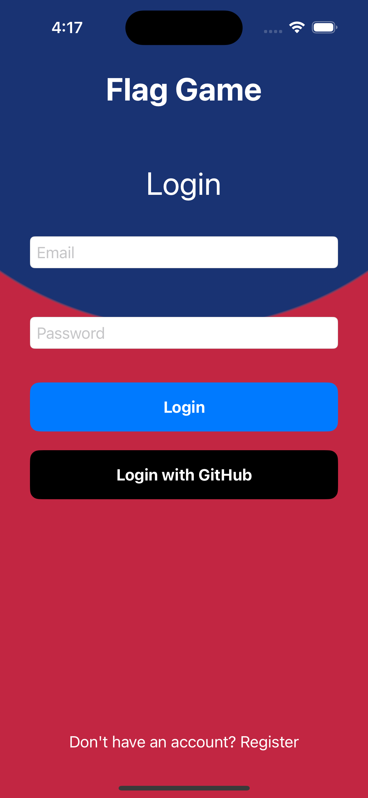
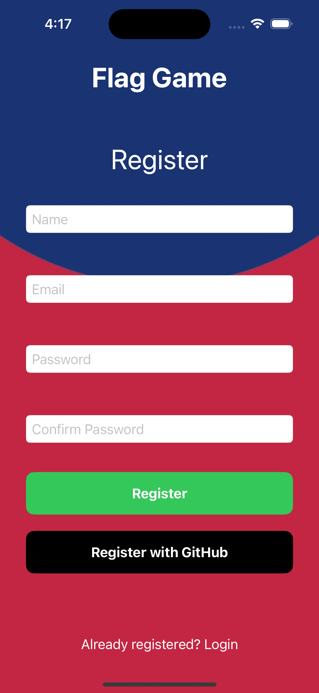
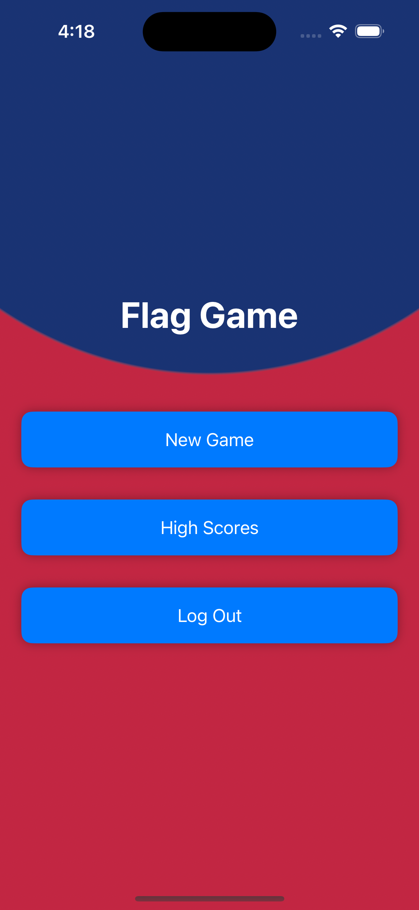
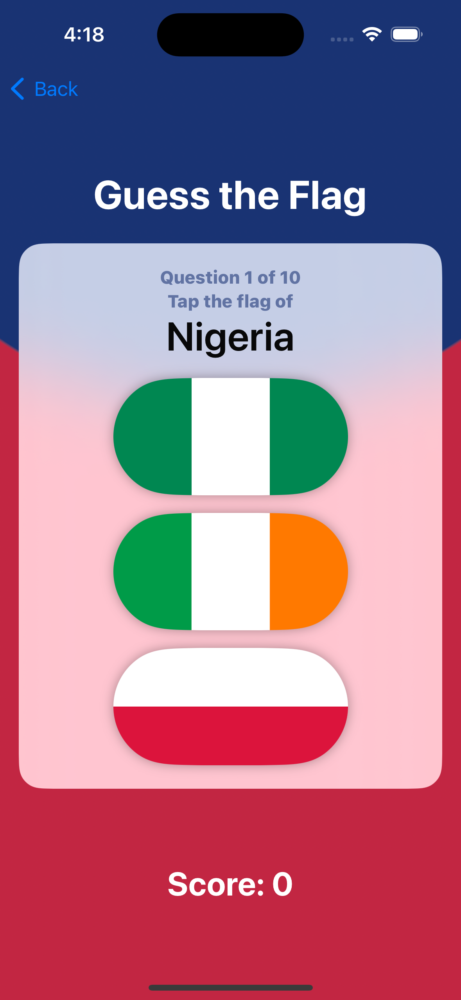
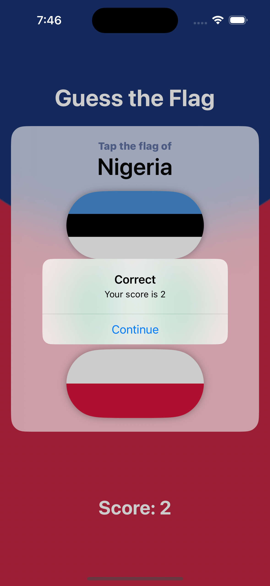
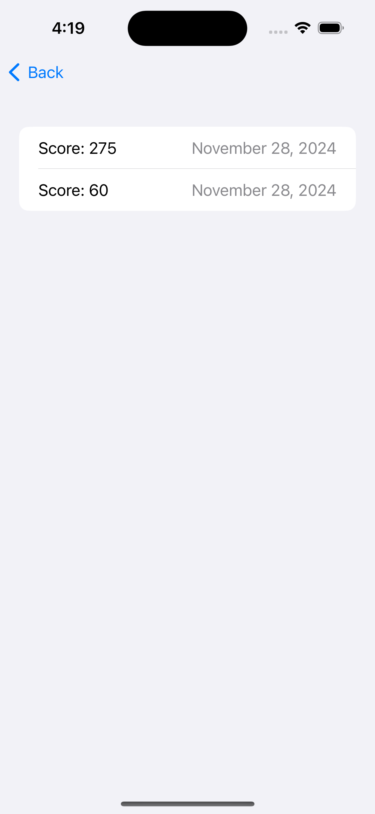

# Flag Game 2.0

Flag Game 2.0 is the new and improved version of the original [Flag Game](https://github.com/HaniumJoli/Flag-Game) app. This version has all the features of the original app, with the addidion of user authentication and cloud storage. Users can now create an account, log in, and save their scores to the cloud.

Flag Game is a simple and fun SwiftUI-based game where users are challenged to guess the correct flag from a set of three options. The app keeps track of the user's score, rewarding correct answers and penalizing incorrect ones.

## Features

- **User Authentication**: Users can create an account or log in using their email and password, r GitHub account.

- **Cloud Storage**: User scores are saved to the cloud, allowing users to access their scores from any device.

- **Randomized Flags**: The flags are shuffled each time a new question is presented.
- **Score Tracking**: The app keeps track of the user's score, which is displayed on the main screen and in an alert after each guess.
- **Interactive UI**: The app uses SwiftUI for a modern and responsive user interface.

## Screenshots

<div style="display: flex; justify-content: space-around; align-items: center;">
    
    
    
    
    
    
</div>

## How to Run

1. **Clone the Repository**: \

    ```sh
    git clone https://github.com/yourusername/flag-game.git
    ```

2. **Open in Xcode**: Open the `Flag Game.xcodeproj` file in Xcode.
3. **Build and Run**: Select a simulator or a connected device and click the Run button in Xcode.
